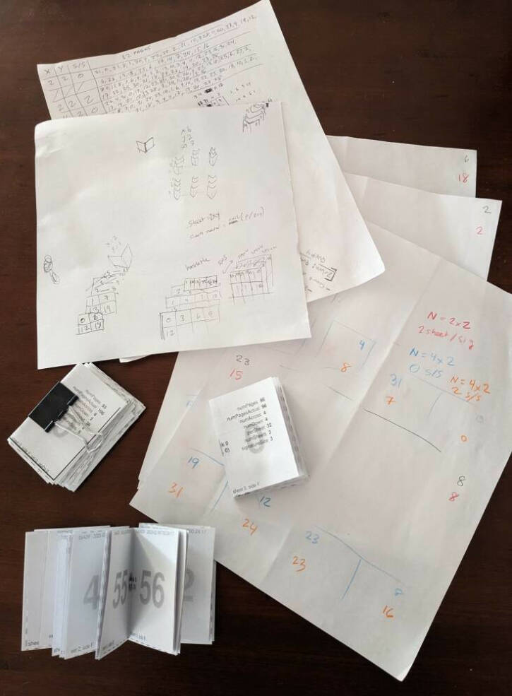

# Technical details

**BookPageOrder** is built to work with N-up, duplex-printed layout ordering.  This ordering will produce results that can be used in the manner described below.

For the sake of clarity, the term **_sheet_** will be used to describe the physical paper medium that comes out of the printer and **_page_** will be used to
describe the smaller unit that will be tiled on this sheet (and ultimate appear as a "page" to the user once cut and assembled).  For example, if the parameters of
`numAcross=4` and `numDown=2` are used, this would results in each _sheet_ having _8 pages_ on each side (16 pages per sheet).

## Collating/Cutting

When sheets are printed duplex, the resulting pile of sheets should be left in the order produced by the printer; no further collation is needed.  There should be
`numSheets` (from BookPageOrder data) such sheets. At this point, it will be necessary to do one or more cuts (except in the trivial case of 2-across 1-down
configuration). The cuts will produce N (across x down) **_stacks_** with two pages on each.  These are ordered in left-to-right-top-to-bottom ("English-reading
order"). The very first stack (top-left) should have **page 0** on its right-half page.

## Assembling

If _no signatures_ were used, simply collect the stacks in order, with each successive stack going _under_ the cumulative collection. This should result in the
finished book, ready to be saddle-stitched or bound as desired.

If signatures are used, the stacks are still collected in the same order, except every N pair of pages (where N is the `signatureSize`) can be set aside as
the signatures, in order.  For example, with a signatureSize of 5, starting at the upper-left stack, collect the first 5 pair of pages to make the first signature.
(It can then be folded and bound as desired.) Then take the _next_ 5 page pairs to complete the second signature, and so on. These N counts can "wrap" across
stacks, or alternately, the whole thing can be collected into one big pile (as with the no-signature configuration above), and signatures can then be "dealt" off
of this deck, N at a time.

## Hints to help with sanity

* The **bottom pair** of pages (of each signature-pile or the entire pile for no-signature, i.e. "flipping over" the pile) should always be `x-1` and `x`
  (consecutive numbers), where `x` is half the number of pages in that pile, and `x` should be even.

* When using signatures, all of the signatures should have the same number of sheets (the value chosen as `signatureSize`). However, the _very last_
  signature _might_ have **less than** `signatureSize`, depending on the number of pages passed in.  (This is reflected in the final value in the
  `signatureSizes` array in the data.)

* If you wish your final book _not_ to have **page numbers**, it may still be helpful to print a version _with page numbers_ overlaid to act as an
  **assembly guide**. Most ideal is that these page numbers be absolute and zero-indexed, that is, the very front cover page starts at 0 and continues through
  (without skipping) to include the back cover / final page as N-1. (i.e. Do not rely on "relative" page numbering that might skip pages, etc.)

## Errors, Future Development, etc.

Speaking of sanity, working out this algorithm was not an easy path! There may be some bugs that pop up given various configuration. Please file an issue if
you think you found one (with the parameters used). Possible enhancements might possibly include "alternative" orderings, such as reversed ordering ("back
to front"), etc. Likely not to happen soon, until my brain heals first.

